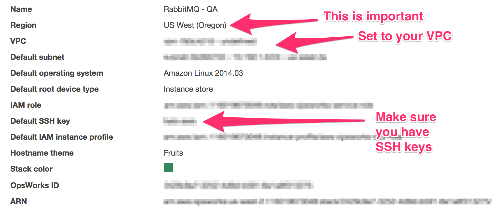
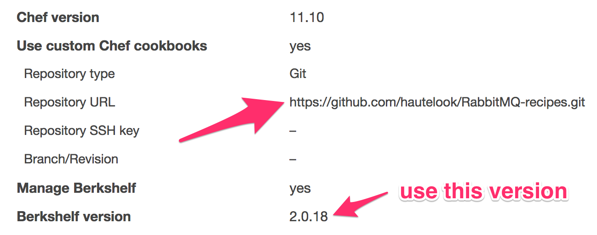
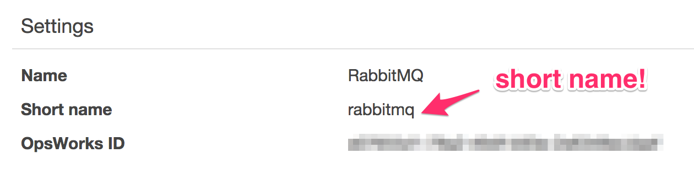
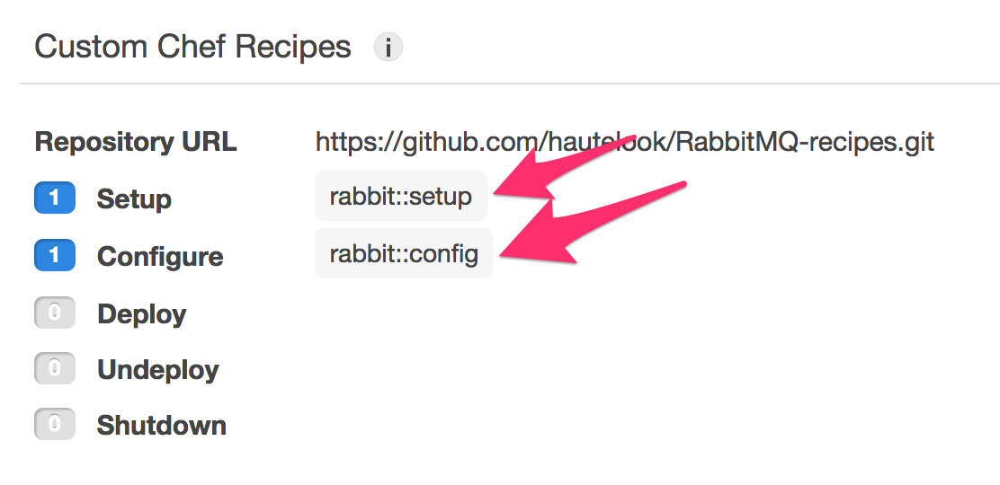
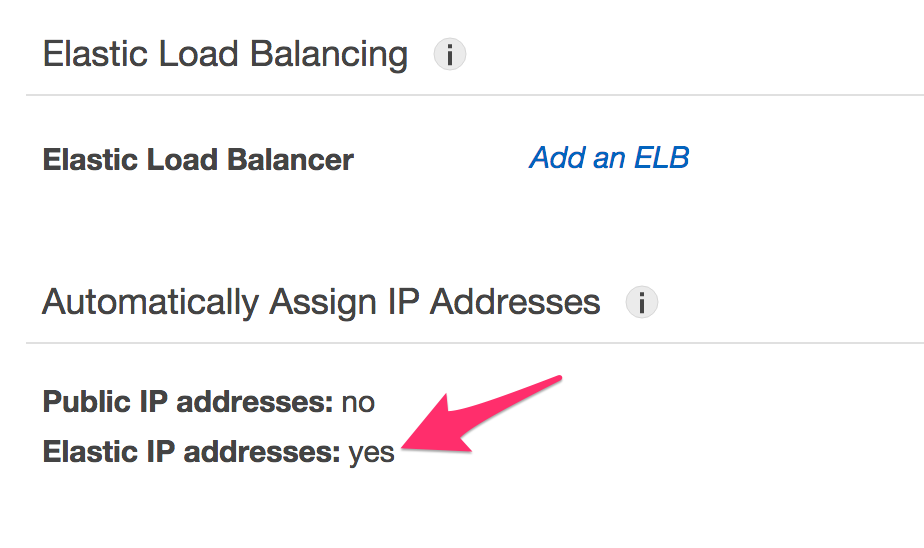
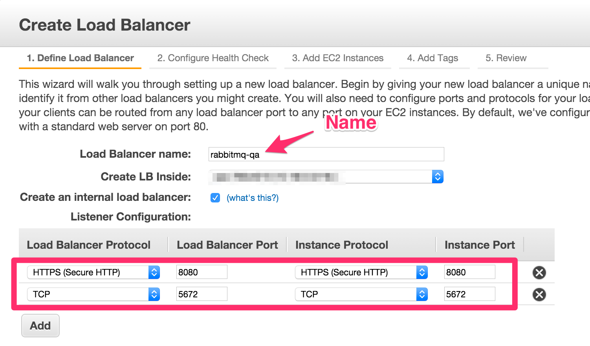
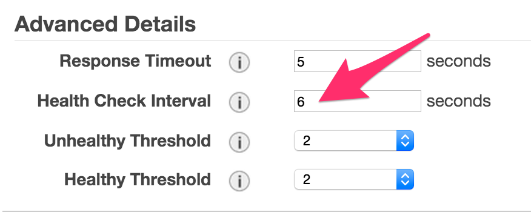
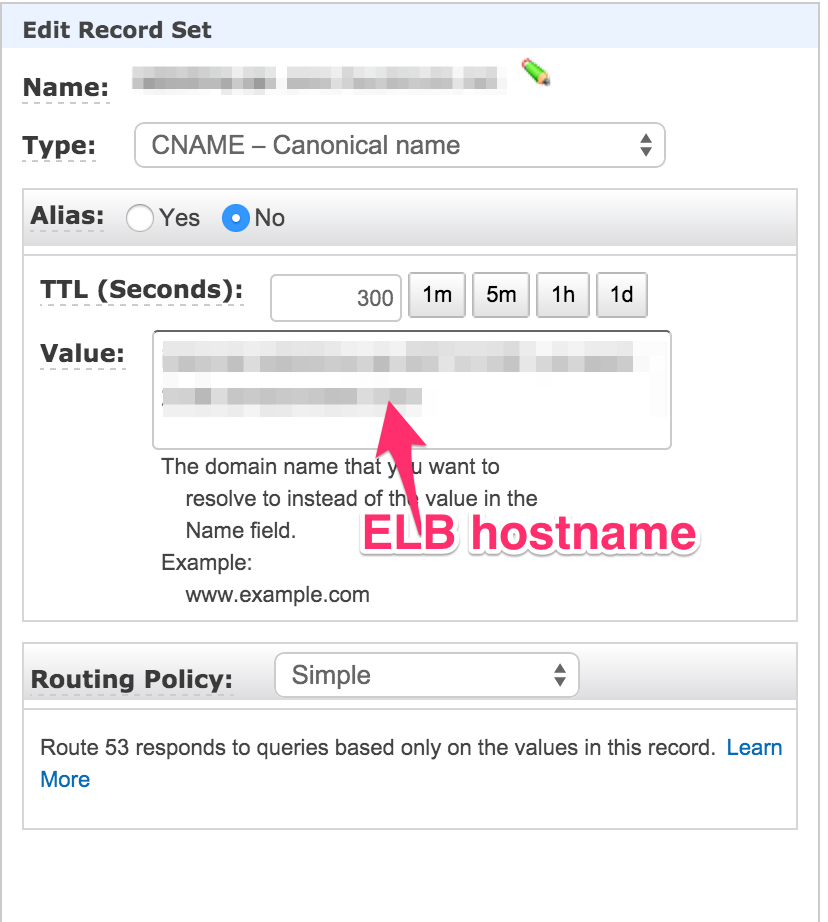

RabbitMQ Recipes
================

These Chef recipes can be used to bring up RabbitMQ clusters on AWS OpsWorks.

Configuration
-------------

Start by creating a new OpsWorks Stack, make sure you set the following options: 





and add the following custom JSON for your stack: 

```json
{
    "chef_environment": "production",
    "rabbitmq": {
        "cluster": true,
        "erlang_cookie": "<some random cookie string here>"
    },
    "rabbit": {
        "user": "rabbit",
        "password": "hare",
        "ssl": {
            "cacert": "<CA cert here>",
            "cert": "<Server cert here>",
            "key": "<Server key here"
        }
    }
}
```

Next, add a _Custom_ layer: 

and make sure that the short name is `rabbitmq`: 



Now, edit the stack you just created, and edit the recipes. Add the two recipes that this cookbook provides: 



Add the networking part, and ensure that elastic IPs are assigned. We will add the ELB later: 



At this step, you can create a new instance, so that it can start up while we set up the ELB, so go ahead and create and start a new instance. 

Then click on the AWS menu in the top left and select EC2, then in the left menu "Load Balancers". Click the 
"Create Load Balancer" button.

Give the Load Balancer a name. Make sure it's in the right zone, and most likely, you want it to be "internal", but this really depends on your routing setup. 



You will have to now select your SSL cert, the ciphers (I left mine on the default), and add it to a subnet. 
You do not have to add any instances at that time, since OpsWorks will take care of that. For the 
health check, I reduced the time between checks, and the number of healthy results, so that the 
nodes get into the pool quicker: 



Go back to OpsWorks and select the stack that we have just created. Go to Layers, and select to edit the network settings. Click on "Add ELB", and select the newly created ELB from the drop down. At tghis point, 
your instance will be added, and after a minute or so, it should become available. 

The last step is that you may want to create a new CNAME record, that is easier to remember. So, head over to Route 53, go to a hosted zone, and create a new Record Set. This is what it should look like: 



At this point, you should be able to go to port 8080 on this new short URL, or the longer load balancer one, and log into the management console using the credentials you put into the custom JSON. 

Feel free to add more instances as required. 
